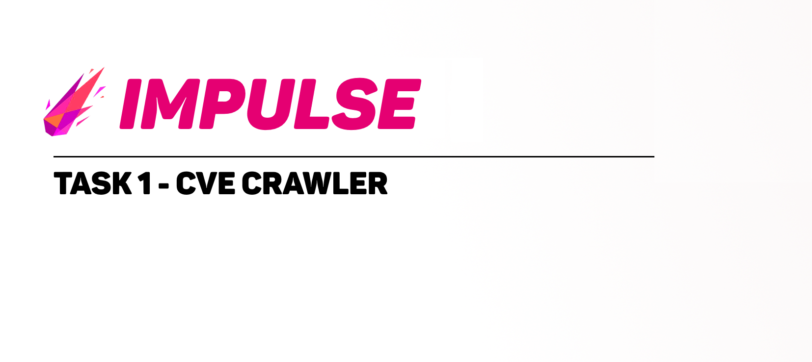
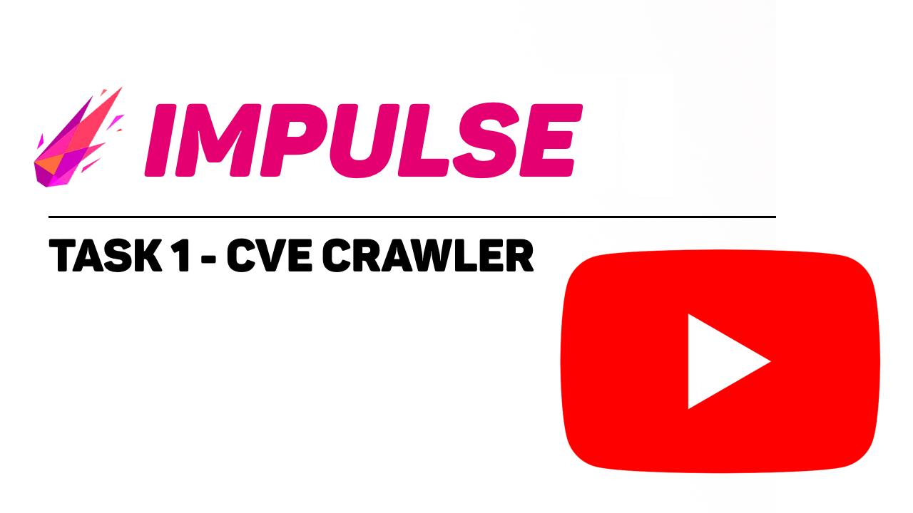

    

<h1 align="left">
BI.ZONE-CVE-Crawler - Telegram Bot
</h1>

&emsp;&emsp;Данный репозиторий включает в себя реализацию кейса по разработке Telegram бота, который позволяет отсеживать в гибкой форме изменения базы CVE от компании BI.ZONE с хакатона "киб_хак" (11.05.2023 - 18.05.2023).

<h2 align="left">
    Описание решения задачи
</h2>
:white_small_square:Бот развернут на https://sbercloud.ru 
:white_small_square:Python Version 3.10 
:white_small_square:Aiogram (telegram lib)  
:white_small_square:Пасит CVE с 
&emsp;&emsp;:radio_button:https://cvetrends.com/ 
&emsp;&emsp;:radio_button:https://cve.mitre.org/ 
&emsp;&emsp;:radio_button:https://www.kali.org/tools/exploitdb/ 
&emsp;&emsp;:radio_button:https://github.com/Sprocket-Security/cvetrends 
&emsp;&emsp;:radio_button:https://github.com/Err0r-ICA/Searchsploit 
&emsp;&emsp;:radio_button:https://t.me/pocfather_bot 
&emsp;&emsp;:radio_button:https://github.com/trickest 
 
:white_small_square:Webapp хостится на github: 
&emsp;https://mad-engineer-142.github.io/ 
&emsp;https://mad-engineer-142.github.io/test2.html   

:purple_square:**Impulse Team**:purple_square::

&emsp;&emsp;:small_blue_diamond: Иорин Давид Андреевич (Team Leader)

&emsp;&emsp;:small_blue_diamond: Богданов Данила Андреевич

&emsp;&emsp;:small_blue_diamond: Беляев Иван Дмитриевич

&emsp;&emsp;:small_blue_diamond: Малахов Арсений Константинович

&emsp;&emsp;:small_blue_diamond: Морозов Андрей Александрович

